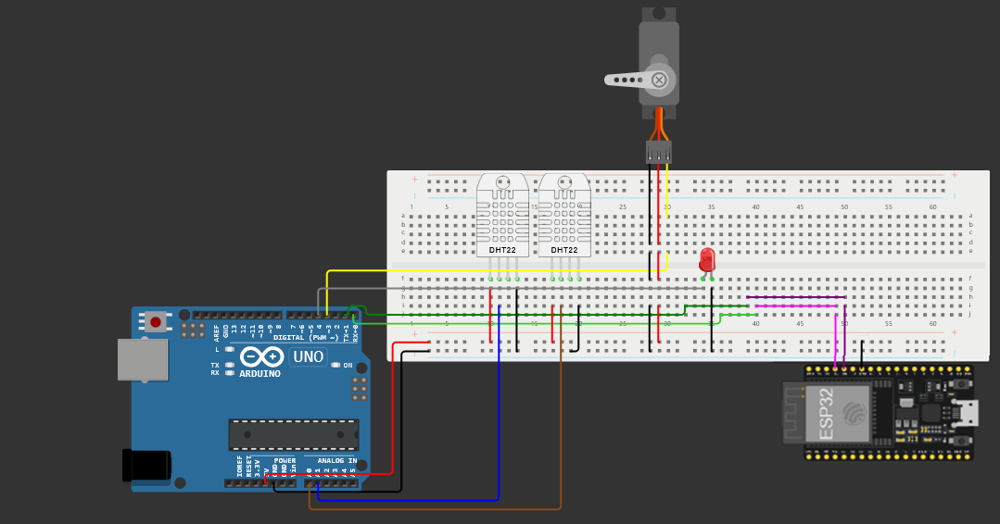

# estufaiot
Estufa iot feita para o evento do Techtalk na trilha de rede promovido pelo Pet da engenharia da computação de Sobral

##Montagem

Segue abaixo a montagem como foi realizado.

No lugar do led vermelho foi ligado a ventoinha mas a plataforma que tinha a imagem não tinha ela então substitui só para fica melhor a exibição.
Os dht usados foram o dht11 não o 12 que veem com um pino de NC então o azul e o marrom correspondem ao data e alimentação segue a mesma, o nosso dht já estava conectado a placa dele assim facilitando a montagem.
