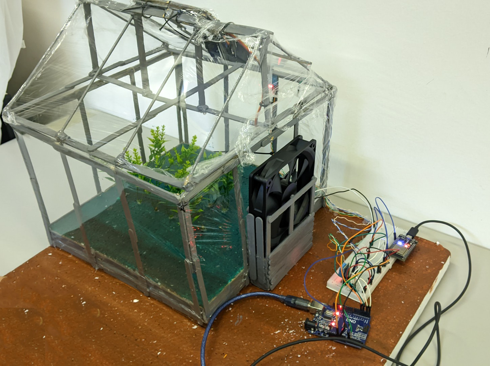

# estufaiot
Estufa iot feita para o evento do Techtalk na trilha de rede promovido pelo Pet da engenharia da computação de Sobral

IoT greenhouse made for the Techtalk event on the network trail promoted by Pet of Engenharia da Computação de Sobral

##Montagem

Segue abaixo a montagem como foi realizado.

No lugar do led vermelho foi ligado a ventoinha mas a plataforma que tinha a imagem não tinha ela então substitui só para fica melhor a exibição.
Os dht usados foram o dht11 não o 12 que veem com um pino de NC então o azul e o marrom correspondem ao data e alimentação segue a mesma, o nosso dht já estava conectado a placa dele assim facilitando a montagem.

The fan was turned on instead of the red LED, but the platform that had the image didn't have it, so I replaced it just to make the display better.
The dht used were the dht11, not the 12 that comes with an NC pin, so the blue and brown correspond to the date and power supply remains the same, our dht was already connected to its board, making assembly easier.

##descricao 

O projeto é um estufa que controla a abertura da exaustão com base na temperatura interna e externa, ela utiliza dois sensores de temperatura e umidade que são o dht11 junto a placa dele e temos IOT o controle dele do feito através do blynk, para abri e fechar o teto utilizamos um servo moto e para comunicação com o blynk usamos o ESP32 e para fazer o acesso do sensores e controlar o servo usamos o  Arduino R3.

The project is a greenhouse that controls the opening of the exhaust based on the internal and external temperature, it uses two temperature and humidity sensors which are the dht11 next to its board and we have IOT control of it done through blynk, to open and closing the roof we used a servo motor and to communicate with the blynk we used the ESP32 and to access the sensors and control the servo we used the Arduino R3.

